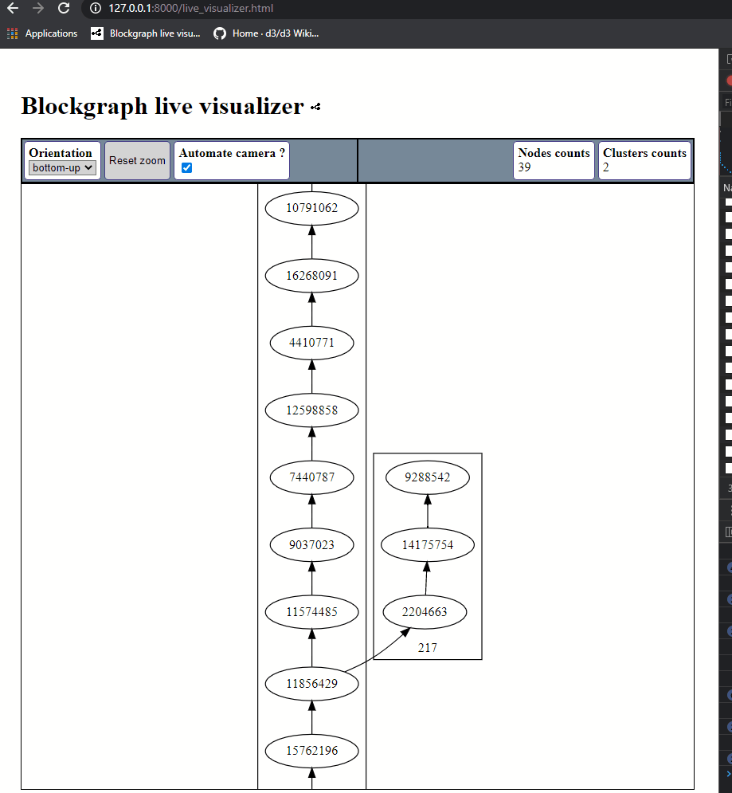
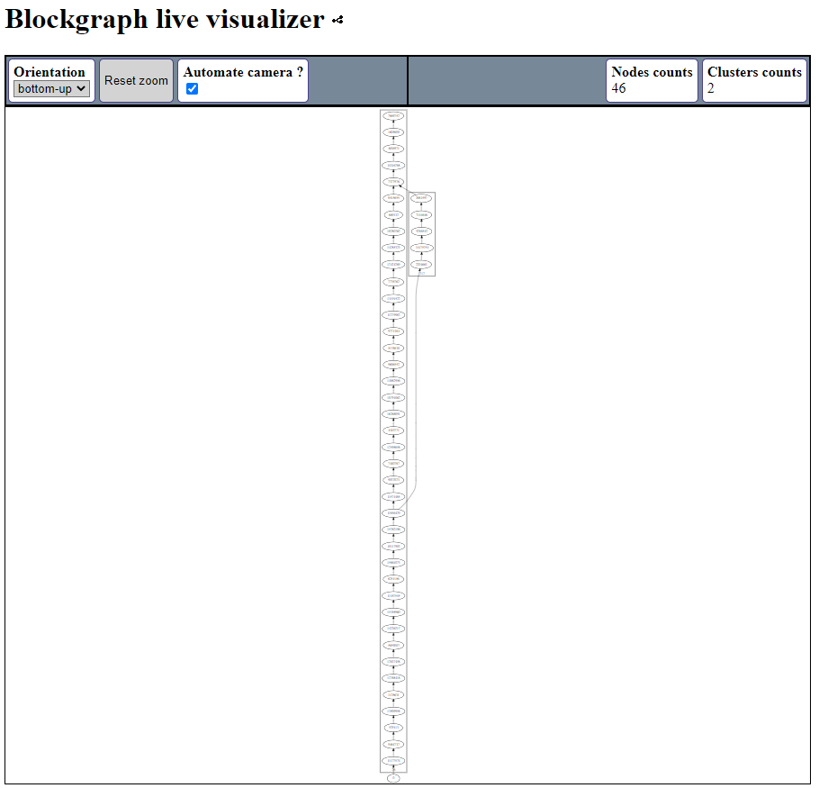
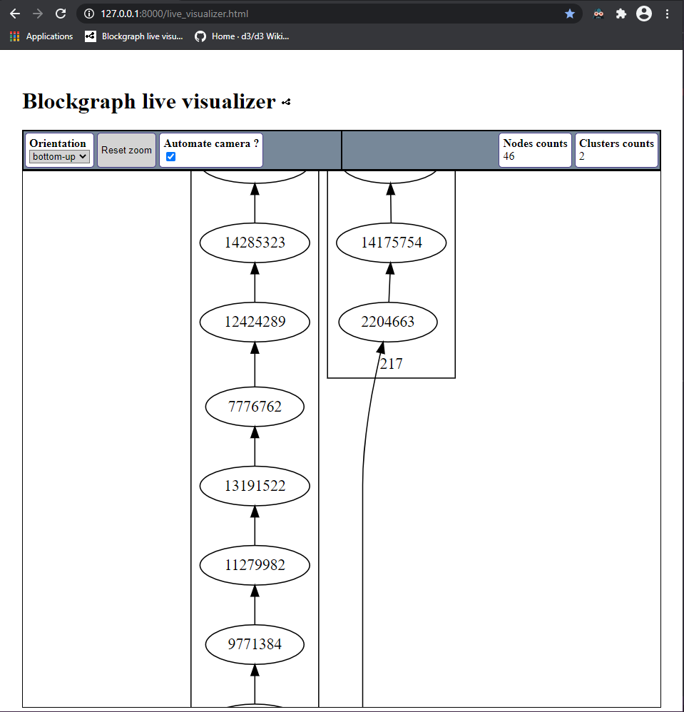
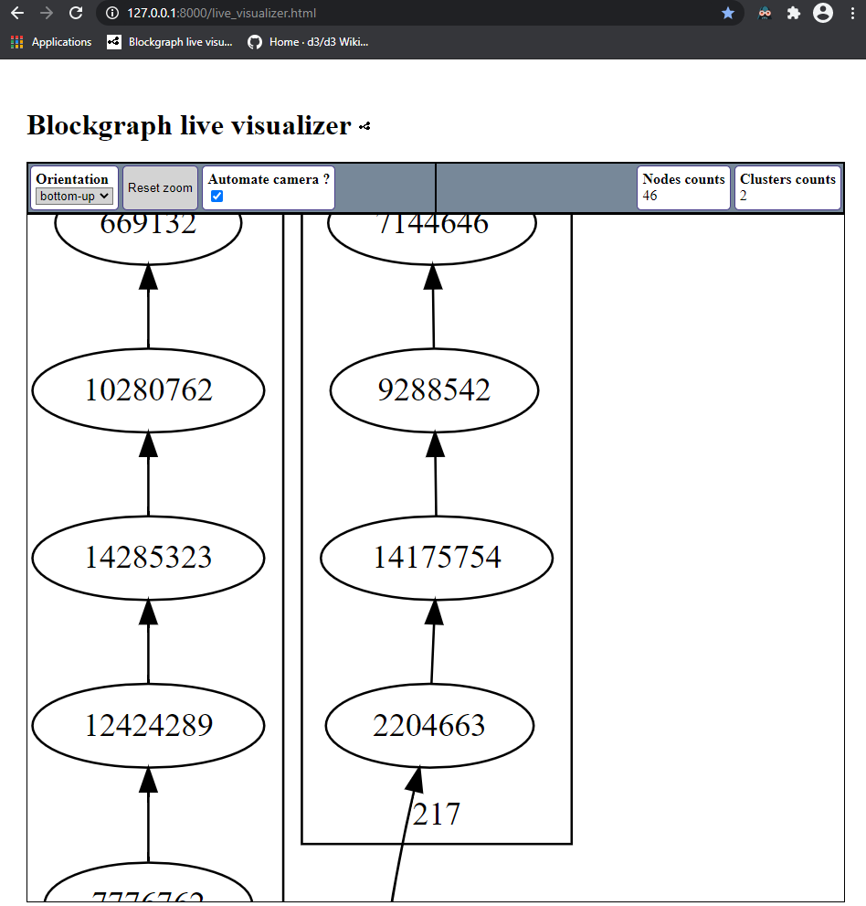
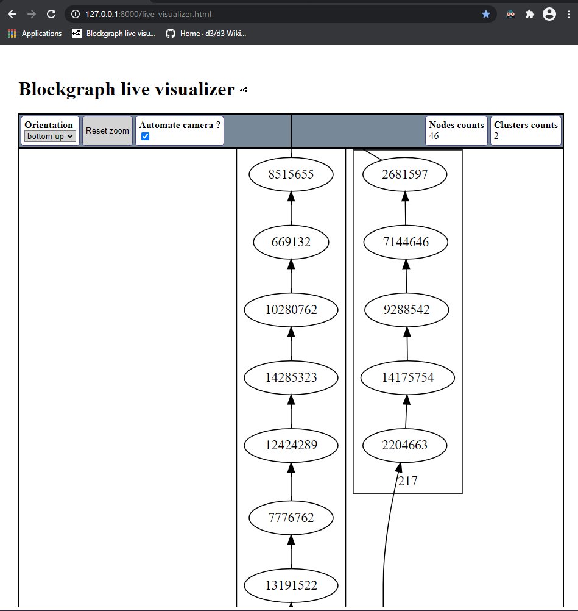
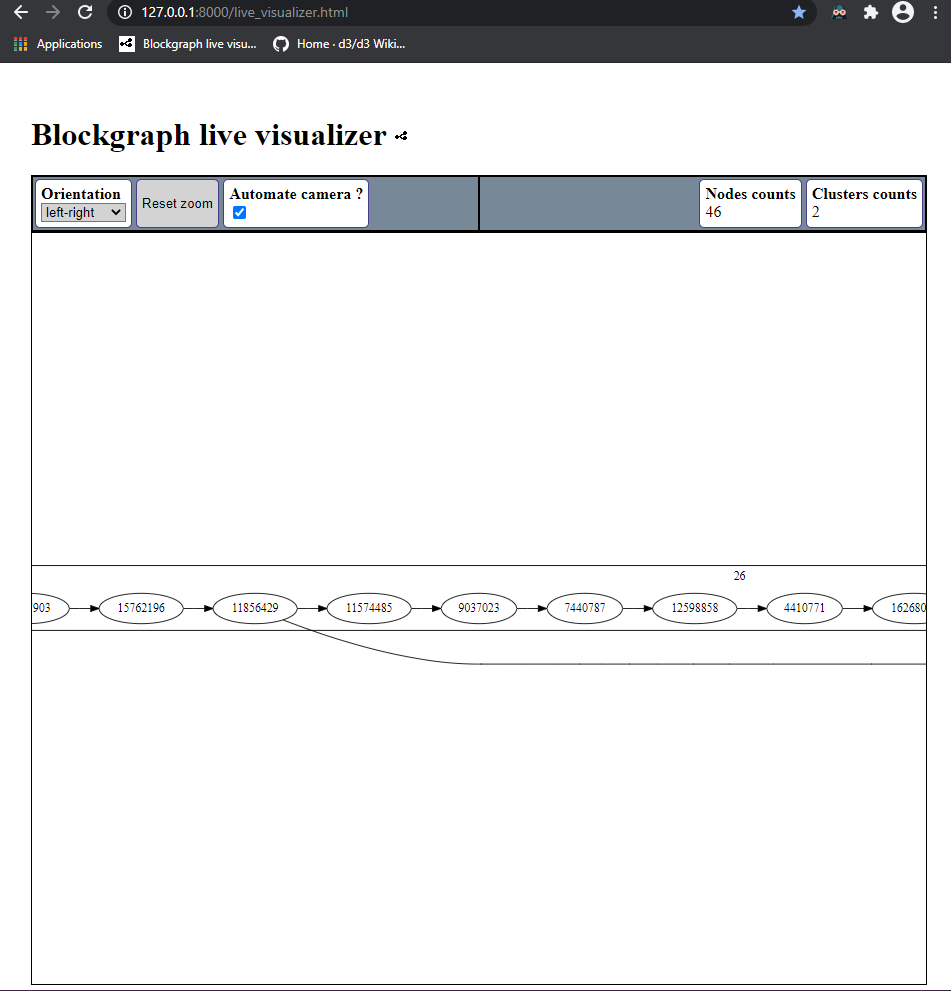
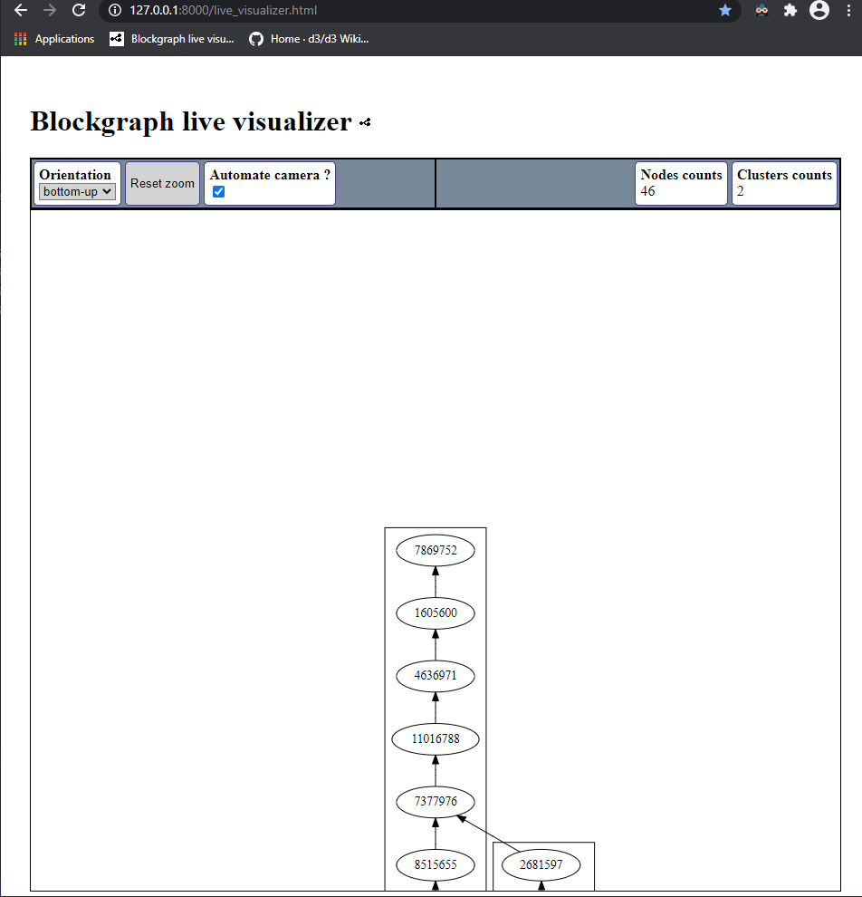

# Blockgraph live visualizer : UI guide

This documentation details UI features.

## Table of content

- [Blockgraph live visualizer : UI guide](#blockgraph-live-visualizer--ui-guide)
  - [Table of content](#table-of-content)
  - [Compatiblity](#compatiblity)
  - [Start](#start)
  - [Pan, zoom](#pan-zoom)
    - [Zoom-in, zoom-out](#zoom-in-zoom-out)
    - [Center and zoom](#center-and-zoom)
    - [Center only (no zoom)](#center-only-no-zoom)
  - [Toolbar](#toolbar)
    - [Graph orientation](#graph-orientation)
    - [Reset zoom *(auto-fit)*](#reset-zoom-auto-fit)
    - [Automate camera](#automate-camera)
  - [Information bar](#information-bar)
  - [Optimizations](#optimizations)
  - [Security](#security)

## Compatiblity

This UI passed tests on using the following web-browsers :

| Web-browser | build |
| ----------- | ----- |
| `Google Chrome`   | *89.0.4389.72 (official build) (64 bits)* |
| `Firefox`         | *78.8.0esr (official build) (32-bit)*     |

However, `Google Chrome` is highly recommended, its internal memory management is way better than Firefox's one.

## Start

When the application starts, the polled datas are displayed so that the entire graph is contained in the rendering frame.

## Pan, zoom

### Zoom-in, zoom-out

Scrolling forward results in a zoom-in, focusing on the mouse's cursor position (relative);  
while scrolling backward results in the opposite behavior.

### Center and zoom

Double-clicking a node results in centering it in the middle of the rendering frame,  
and applying an absolute zoom factor of 4.

> Here, `14175747`.

### Center only (no zoom)

> Here, `14285323`.

## Toolbar

### Graph orientation

Using the upper-left combo-box button below the *"Orientation"* label,  
the user can change the rendered graph orientation, using the following values :

- Top-down
- Bottom-up
- Left-right
- Right-left

Here, `left-right` :

### Reset zoom *(auto-fit)*

Any click on this button will reset the current zoom,  
so the entire graph would fit in the rendering frame.

NB : However, the current orientation is preserved.

### Automate camera

This checkbox allows an automatic behavior which always center the freshest (not always last) element of the graph on the rendering frame.

This is meant to allow live visualization of large, dynamic graphs without manual pan/zoom.

## Information bar

In the upper-right corner, some useful informations about the graph currently rendered are displayed.

- Nodes's count
- Clusters's count

## Optimizations

- You are guarantee that no rendering are performed when the tab is hidden.
- No rendering are performed if polled datas are the same as the ones already rendered.

## Security

- Be warned that the last polled datas are always stored in `JS` cache, after a JSON-to-DOT conversion.  
  This is a D3 rendering requirement.
