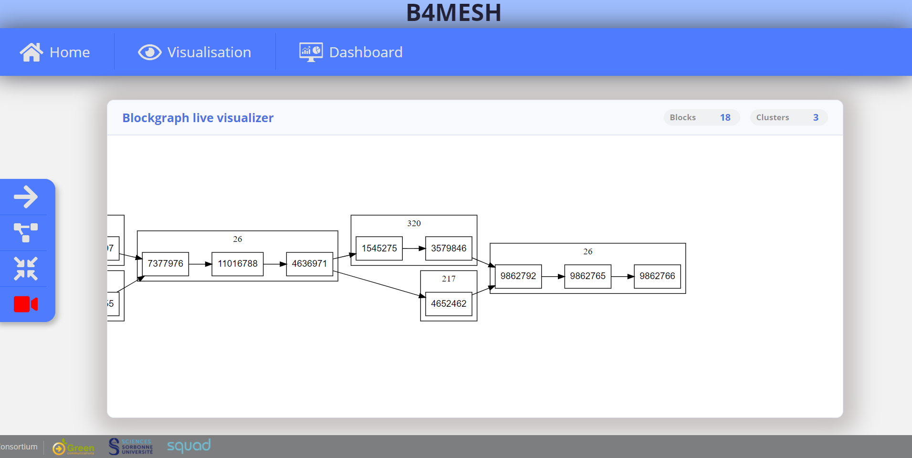

# Blockgraph live visualizer : UI guide

This documentation details UI features.

## Table of content

- [Blockgraph live visualizer : UI guide](#blockgraph-live-visualizer--ui-guide)
  - [Table of content](#table-of-content)
  - [Compatiblity](#compatiblity)
  - [Start](#start)
  - [Pan, zoom](#pan-zoom)
    - [Zoom-in, zoom-out](#zoom-in-zoom-out)
    - [Center and zoom](#center-and-zoom)
  - [Toolbar](#toolbar)
    - [Graph orientation](#graph-orientation)
    - [Change view](#change-view)
    - [Reset zoom *(auto-fit)*](#reset-zoom-auto-fit)
    - [Automate camera](#automate-camera)
  - [Information bar](#information-bar)
  - [Dashboard](#dashboard)
  - [Optimizations](#optimizations)
  - [Security](#security)

## Compatiblity

This UI passed tests on using the following web-browsers :

| Web-browser | build |
| ----------- | ----- |
| `Google Chrome`   | *90.0.4430.93 (Build officiel) (64 bits)* |
| `Firefox`         | *88.0  (official build) (64 bits)*        |

However, `Google Chrome` is highly recommended, its internal memory management is way better than Firefox's one.

## Start

When the application starts, the polled datas are displayed so that the entire graph is contained in the rendering frame.

## Pan, zoom

### Zoom-in, zoom-out

Scrolling inside the forward results in a zoom-in, focusing on the mouse's cursor position (relative);  
while scrolling backward results in the opposite behavior.

### Center and zoom

Double-clicking a node  results in centering it in the middle of the rendering frame,  
and applying an absolute zoom factor of 4.

## Toolbar

On the left of the screen we can find a menu that serves as a toolbar for visualising the graph with greater usability.

### Graph orientation

Upon clicking the icon with the arrow the graph will change its position by 90 degree clockwise. the icon will also move 90 degree and will always represent de orientation of the graph. 
For example if the arrow points towards East, the graph is read from left to right.

We can have these four differents orientations:

- Top-down  
- Bottom-up
- Left-right
- Right-left

Here, `bottom-up` :

Here, `top-down` :

### Change view

The second button on the toolbar let the user change between two differents views.

The one by default is a view based on event and time, it is the common way of watching a blockhain.

the second view is a view of the blockgraph where the blocks are regrouped by cluster .

### Reset zoom *(auto-fit)*

the third button will reset the current zoom,  
so the entire graph would fit in the rendering frame.

NB : However, the current orientation is preserved.

### Automate camera
the last button allows the user to have the camera moving automatically. which means it will always center towards the freshest (not always last) element of the graph on the rendering frame.

This is meant to allow live visualization of large, dynamic graphs without manual pan/zoom.

## Information bar

In the upper-right corner, some useful informations about the graph currently rendered are displayed.

- Nodes's count
- Clusters's count

## Dashboard
You can click on the Dashboard button located on the top menu to access differents metrics.

On this page you can find the listed metrics:
- Number of transactions in the blockgraph.
- Number of transaction in the node generated.
- Transaction per second.
- Time between blocks.
- Size of the blockgraph.
- Mempool usage of the node.
- Last 10 transactions commited in the blockgraph.

All the metrics in the blockgraph are updated live as the blockgraph evolve.

## Optimizations

- You are guarantee that no rendering are performed when the tab is hidden.
- No rendering are performed if polled datas are the same as the ones already rendered.

## Security

- Be warned that the last polled datas are always stored in `JS` cache, after a JSON-to-DOT conversion.  
  This is a D3 rendering requirement.
